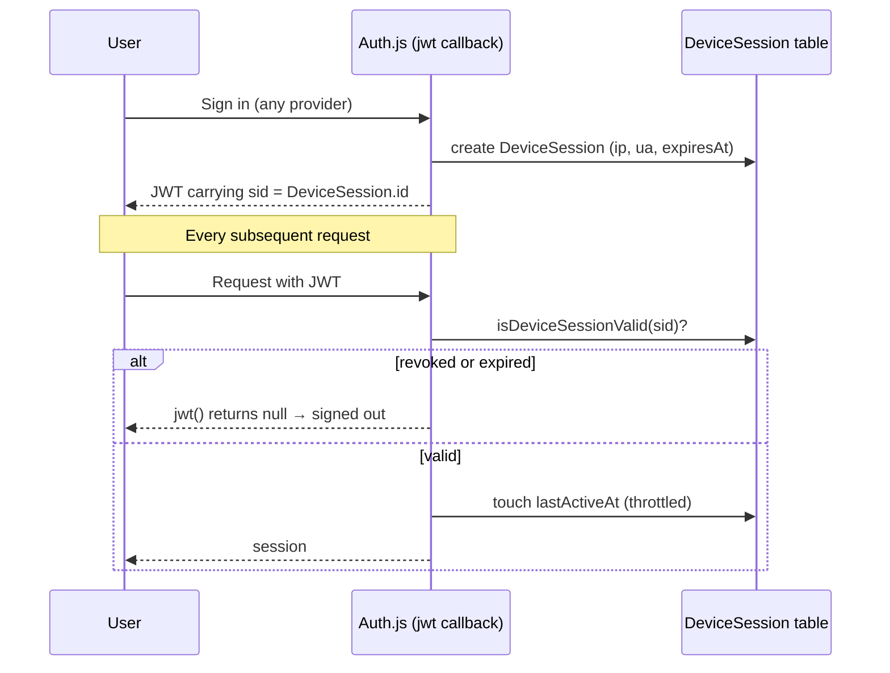
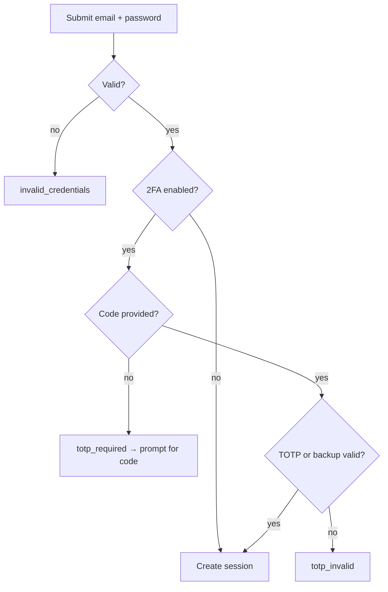

# Authentication & Account System

A production-grade authentication and account-management system for Lalang, built
on **Auth.js v5 (NextAuth)**, **Prisma/PostgreSQL** and the App Router.

- [Why Auth.js (not Better Auth)](#why-authjs)
- [Architecture](#architecture)
- [Session & revocation model](#session--revocation-model)
- [Sign-in flows](#sign-in-flows)
- [Feature map](#feature-map)
- [Database schema](#database-schema)
- [API reference](#api-reference)
- [Environment variables](#environment-variables)
- [Google OAuth & One Tap setup](#google-oauth--one-tap-setup)
- [Email delivery](#email-delivery)
- [Deployment & migration](#deployment--migration)

---

## Why Auth.js

The project already ran on Auth.js v5 with a working Prisma adapter and Google +
Credentials providers. Rather than replace a working foundation, we kept Auth.js
and solved its one real gap — **revoking individual JWT sessions** — with a
`DeviceSession` table plus a per-request revocation check (see below). This gives
true "revoke session / log out everywhere" without switching frameworks.

| | Auth.js v5 (chosen) | Better Auth |
| --- | --- | --- |
| Already integrated | ✅ | ❌ (full rewrite) |
| Prisma adapter + Google | ✅ | ✅ |
| Credentials + JWT | ✅ | ✅ |
| Session revocation | Added via `DeviceSession` | Built-in |
| Migration risk | None | High |

---

## Architecture

```
src/
├── lib/
│   ├── auth.ts                 # NextAuth config (providers, callbacks, events)
│   ├── auth/
│   │   ├── credentials.ts      # email+password (+TOTP) authorize
│   │   ├── passkey.ts          # WebAuthn assertion authorize
│   │   ├── onetap.ts           # Google One Tap ID-token authorize
│   │   ├── bootstrap.ts        # device-session creation on sign-in
│   │   ├── provisioning.ts     # default rows + new-device alerts
│   │   └── errors.ts           # typed CredentialsSignin codes
│   ├── session-store.ts        # create / validate / revoke DeviceSessions
│   ├── tokens.ts               # email-verify / reset / email-change tokens
│   ├── totp.ts                 # TOTP secrets, QR, verify, backup codes
│   ├── webauthn.ts             # SimpleWebAuthn options + verification
│   ├── password.ts             # bcrypt + HIBP breach check
│   ├── crypto.ts               # token hashing + AES-256-GCM secret sealing
│   ├── reauth.ts               # "sudo mode" step-up
│   ├── mail/                   # Resend sender + HTML templates
│   ├── audit.ts                # AuditLog + LoginHistory writers
│   ├── request.ts              # IP/UA parsing + same-origin (CSRF) check
│   ├── api.ts                  # route helpers (json, errors, rate limit, csrf)
│   └── account.ts              # aggregate for the dashboard
├── app/api/…                   # 30+ route handlers (see API reference)
├── app/(auth pages)            # login, register, forgot/reset, verify-*
├── app/account/…               # dashboard: overview, profile, security, …
└── components/{auth,account,ui}
```

**Providers**: `credentials` (email/password + TOTP), `passkey` (WebAuthn),
`google` (OAuth), `googleonetap` (One Tap ID token). The last three are only
registered when their prerequisites are configured.

---

## Session & revocation model

Because a Credentials provider forces the **JWT** session strategy, stateless
tokens can't be revoked out of the box. We make them revocable:



- **Remember me** → `DeviceSession.expiresAt` = now + 30 days; otherwise 12 hours.
- **Revoke one** → set `revokedAt`; next request from that device is rejected.
- **Log out everywhere** → revoke all rows except the current `sid`.
- **Password reset** revokes **all** sessions; **password change** keeps the
  current device and revokes the rest.

Middleware (`src/middleware.ts`) does a cheap cookie-presence redirect for
`/account/*` (edge-safe, no DB); the account layout re-verifies with `auth()`.

---

## Sign-in flows

### Email + password (+ 2FA)



### Passkey (passwordless)

`POST /api/webauthn/authenticate/options` → `startAuthentication()` in the
browser → `signIn('passkey', { response })` → server verifies the assertion,
bumps the credential counter, and creates a session.

### Google OAuth / One Tap

Standard redirect via the `google` provider, or One Tap: the GIS credential
(an ID token) is verified server-side with `google-auth-library`
(`aud === client_id`, `email_verified === true`) and bridged through the
`googleonetap` provider. Accounts with a matching verified email are linked.

---

## Feature map

| Feature | Where |
| --- | --- |
| Email register / login / logout | `credentials` provider, `/api/register` |
| Google OAuth + One Tap | `google` / `googleonetap` providers |
| Passkeys (WebAuthn) | `/api/webauthn/*`, `passkey` provider |
| Remember me / session length | `DeviceSession.expiresAt` |
| Email verification | `/api/verify-email`, `EmailVerificationToken` |
| Forgot / reset password | `/api/password/forgot` · `/reset` |
| Change password / email | `/api/password/change` · `/api/email/change` |
| Re-authentication (sudo) | `lib/reauth.ts`, `/api/reauth` |
| TOTP 2FA + backup codes | `/api/mfa/*`, `lib/totp.ts` |
| Device sessions + revoke | `/api/sessions*`, `lib/session-store.ts` |
| Login history | `/api/login-history`, `LoginHistory` |
| Connected accounts | `/api/connected-accounts` |
| Avatar upload / remove | `/api/avatar*` (stored in Postgres) |
| Profile / settings / notifications | `/api/profile` · `/settings` · `/notifications` |
| Delete / deactivate account | `/api/account` · `/api/account/deactivate` |
| Audit trail | `AuditLog`, `lib/audit.ts` |

---

## Database schema

New models added on top of the existing `User/Account/Session`:

- **UserProfile** – names, bio, phone, location, country, timezone, occupation,
  website, birthday, social links (JSON).
- **UserSettings** – theme, locale, timezone, privacy (visibility, show email /
  activity), reduced-motion. (Consolidates the spec's *UserSettings* +
  *UserPreferences*.)
- **NotificationPreference** – email channel toggles (security alerts locked on).
- **Avatar** – uploaded image bytes + mime, served via `/api/avatar/[userId]`.
- **DeviceSession** – revocable sessions (the `sid` in each JWT).
- **LoginHistory** – append-only auth-attempt log (success/failure/logout).
- **AuditLog** – sensitive-action trail (`SetNull` on user delete so it persists).
- **PasswordResetToken / EmailVerificationToken / EmailChangeToken** – SHA-256
  hashes of single-use tokens (the raw value is emailed, never stored).
- **Authenticator** – WebAuthn credentials (public key as `Bytes`).
- **BackupCode** – bcrypt-hashed one-time 2FA recovery codes.
- **User** additions – `username`, `status`, `deactivatedAt`, `twoFactorEnabled`,
  `totpSecret` (AES-GCM sealed), `totpLastStep` (replay guard), `lastLoginAt`.

> *ConnectedProvider* from the spec is the existing `Account` model — the
> "Connected accounts" screen reads from it directly rather than duplicating it.

---

## API reference

All mutating routes enforce a same-origin (CSRF) check and are rate-limited.
Responses use `{ error, fields?, code?, retryAfter? }` on failure.

| Method & path | Auth | Purpose |
| --- | --- | --- |
| `POST /api/register` | — | Create account, send verification email |
| `POST /api/verify-email` | — | Confirm email from token |
| `POST /api/verify-email/resend` | ✅ | Resend verification email |
| `POST /api/password/forgot` | — | Send reset link (enumeration-safe) |
| `POST /api/password/reset` | — | Reset password from token |
| `POST /api/password/change` | ✅ + sudo | Change password |
| `POST /api/email/change` | ✅ + sudo | Request email change |
| `POST /api/email/verify-change` | — | Confirm new email from token |
| `GET/PATCH /api/profile` | ✅ | Read / update profile |
| `POST/DELETE /api/avatar` | ✅ | Upload / remove avatar |
| `GET /api/avatar/[userId]` | — | Serve avatar bytes |
| `PATCH /api/settings` | ✅ | Update settings / privacy / theme |
| `PATCH /api/notifications` | ✅ | Update notification prefs |
| `GET/DELETE /api/sessions` | ✅ | List / revoke-others |
| `DELETE /api/sessions/[id]` | ✅ | Revoke one session |
| `GET /api/login-history` | ✅ | Recent auth events |
| `GET/DELETE /api/connected-accounts` | ✅ | List / unlink providers |
| `POST /api/reauth` | ✅ | Step-up ("sudo mode") |
| `POST /api/mfa/totp/setup` | ✅ + sudo | Begin TOTP enrollment (QR) |
| `POST /api/mfa/totp/enable` | ✅ + sudo | Confirm code, enable, issue codes |
| `POST /api/mfa/totp/disable` | ✅ + sudo | Disable 2FA |
| `POST /api/mfa/backup-codes` | ✅ + sudo | Regenerate backup codes |
| `POST /api/webauthn/register/options` | ✅ | Passkey registration options |
| `POST /api/webauthn/register/verify` | ✅ | Store a passkey |
| `POST /api/webauthn/authenticate/options` | — | Passkey login options |
| `GET /api/passkeys` · `DELETE|PATCH /api/passkeys/[id]` | ✅ | Manage passkeys |
| `POST /api/account/deactivate` | ✅ + sudo | Deactivate account |
| `DELETE /api/account` | ✅ + sudo | Permanently delete account |

---

## Environment variables

See [`.env.example`](../.env.example) for the annotated list.

| Variable | Needed for |
| --- | --- |
| `DATABASE_URL` | Everything below |
| `AUTH_SECRET` | Signing sessions (`npx auth secret`) |
| `AUTH_URL` / `NEXT_PUBLIC_APP_URL` | Email links, WebAuthn origin, cookies |
| `TOTP_ENC_KEY` | Encrypting TOTP secrets (falls back to `AUTH_SECRET`) |
| `RESEND_API_KEY` | Sending real email (else logged to console) |
| `EMAIL_FROM` | Sender address |
| `GOOGLE_CLIENT_ID` / `GOOGLE_CLIENT_SECRET` | Google OAuth |
| `NEXT_PUBLIC_GOOGLE_CLIENT_ID` | Google One Tap (browser) |

Every optional integration degrades gracefully when unset.

---

## Google OAuth & One Tap setup

1. In the [Google Cloud Console](https://console.cloud.google.com/apis/credentials)
   create an **OAuth 2.0 Client ID** (type *Web application*).
2. **Authorized JavaScript origins**: `http://localhost:3000` (and your prod URL).
3. **Authorized redirect URIs**: `http://localhost:3000/api/auth/callback/google`
   (and the prod equivalent).
4. Copy the client ID/secret into `.env`:
   ```env
   GOOGLE_CLIENT_ID=…apps.googleusercontent.com
   GOOGLE_CLIENT_SECRET=…
   NEXT_PUBLIC_GOOGLE_CLIENT_ID=…apps.googleusercontent.com   # same id
   ```
5. Restart the dev server. The Google button and One Tap prompt appear
   automatically once the client ID is present.

One Tap uses FedCM (the current Google Identity Services default) — no extra
configuration is needed beyond the client ID.

---

## Email delivery

Transactional email uses [Resend](https://resend.com). **Without a
`RESEND_API_KEY`, emails are logged to the server console** — including the
verification/reset links — so every flow is testable locally. To send for real,
add a key and a verified `EMAIL_FROM` domain.

---

## Deployment & migration

- **Migrations**: `npm run db:migrate` in dev; `prisma migrate deploy` in CI/prod
  (already wired into the `vercel-build` script). The new tables are added by
  `prisma/migrations/*_auth_ecosystem/`.
- **Secrets in production**: set a dedicated `TOTP_ENC_KEY` (32 random bytes,
  base64) kept off the database host, a strong `AUTH_SECRET`, and real Google /
  Resend credentials.
- **Cookies** become `__Secure-`/`__Host-` prefixed and `Secure` automatically in
  production (`useSecureCookies`).
- **Upgrading to Next 16**: rename `src/middleware.ts` to `proxy.ts`
  (`npx @next/codemod middleware-to-proxy`).

See [SECURITY.md](./SECURITY.md) for the OWASP-aligned control decisions.
